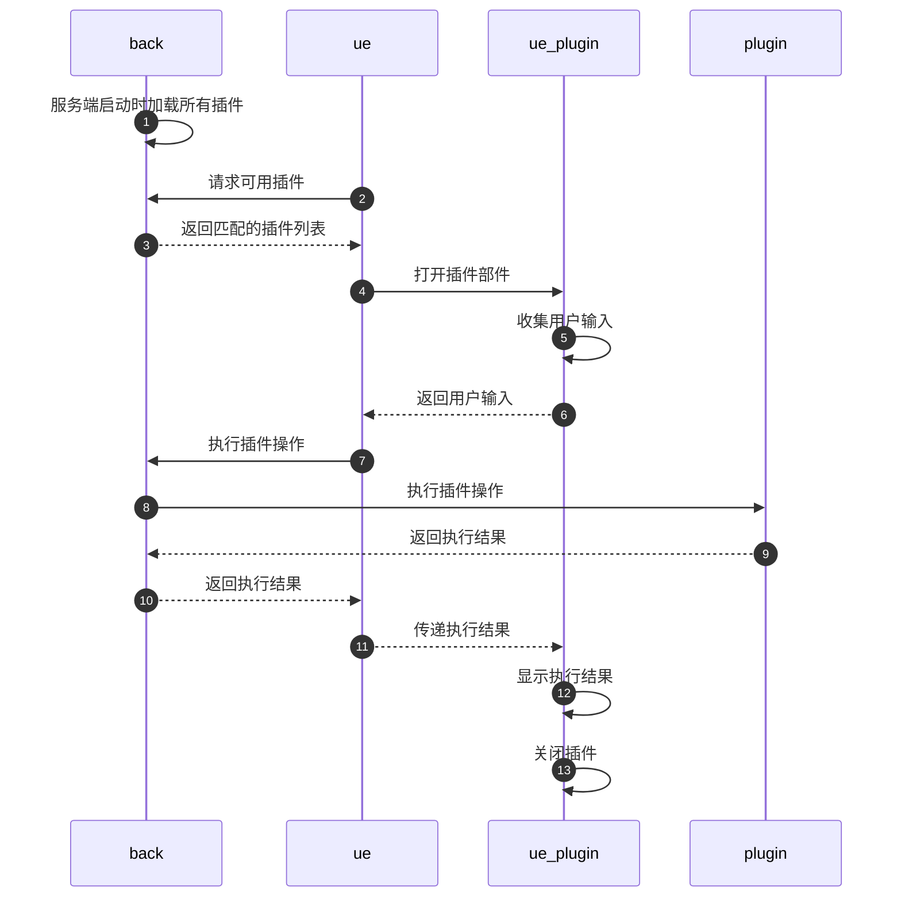

# 目的

插件用于扩展系统的功能。系统提供了基础的增删改查操作，但是很多时候需要对数据进行更复杂的处理，例如：对集合中符合条件的文档中某一列，根据外部接口的查询结果进行填写。这些依赖于特定的业务场景的功能，就需要放在插件中实现。

每个插件都有确定的适用对象类型，包括：数据库，集合，文档。和`TMW`的基础功能配合，插件出现在数据库列表，集合列表和文档列表页中，提供给用户使用。

每个插件接收用户指定的输入参数，例如：一组文档的 id 或筛选条件等，执行内部逻辑，反馈执行结果。

有时，除了需要用户指定要处理的管理对象，插件还需要用户提供额外的参数，这类问题通过前端部件（Widget）解决。前端部件就是可以独立完成某种业务逻辑的交互组件，例如：选择集合，选择某些文档等。

插件的执行分为如下步骤：



# 设计考虑

## 获得插件

通过接口`plugins/list?scope=?`获得可用插件。`scope`的取值包括：`database`，`collection`和`document`。还包括基础参数数据库名称`db`和集合名称`cl`。

## 控制插件可见

定义插件时包含`dbName`，`clName`属性，类型时正则表达式，系统会根据传入的数据库名称和集合名称进行匹配。

有时候，插件只能适用于或者不能适用于某一类管理对象，这类问题通过标签解决。系统支持给集合打标签，插件也支持设置标签，在获取适用插件时，系统会根据标签的匹配情况进行筛选。

## 定制用户输入参数

### 内置部件

插件指定要使用的部件，并且说明是否给部件提供参数。部件是一种可复用的业务级组件，它们有一致的打开方式和参数返回方式。

如果需要由插件指定打开部件的参数，例如：只选择状态符合指定值的记录，调用接口`plugins/remoteWidgetOptions`。

### 自定义部件

系统支持自定义插件部件。在执行插件的页面通过`iframe`调用插件部件的地址，插件收集的用户输入通过`postMessage`返回给插件调用页面。

## 关闭基本操作

有时，系统提供的基本操作可能和插件的操作有冲突，例如：集合中添加和删除记录时要同步更新另一个集合中的数据，如果用户直接执行了基本删除操作就会导致数据不一致。解决这类问题的一个方法是关闭基本操作，只允许通过插件更新数据。通过集合的`custom.operations`可以设置对集合中文档的基本操作。

## 运行插件

通过接口`plugins/execute`执行插件。通过消息体（request.body），管理界面上的参数通过`docIds`和`filter`传递，部件参数通过`widget`中传递。

插件必须按照 3 种方式返回结果：

1. 返回变更的文档数据，包括：inserted，modified，removed；
2. 返回变更的数值，包括：nInserted，nModified，nRemoved；
3. 返回文本消息。

系统会根据返回类型的不同，进行相应的处理。

# 实现插件

## 配置文件

在`back/config`下创建`plugin.js`或`plugin.local.js`文件。

```js
module.exports = {
  dir: 'plugins', // 存放插件的目录，绝对路径，或，启动位置相对路径
}
```

系统内部采用`glob`库查找文件，所以查找路径可以按照`glob`的规则设置。支持用逗号分隔多条规则。

## 插件属性

插件必须是`.js`结尾的文件，必须放在配置文件指定的目录中。

插件必须继承`models/plugin`模块中的`PluginBase`类。

插件必须要包含`name`，`scope`，`title`，`description`信息，建议用`get`方法提供。

| 属性                             | 说明                                 | 类型     | 必填 |
| -------------------------------- | ------------------------------------ | -------- | ---- |
| name                             | 插件名                               | string   | 是   |
| scope                            | 适用管理对象                         | string   | 是   |
| title                            | 按钮名称                             | string   | 是   |
| description                      | 描述信息                             | string   | 是   |
| disabled                         | 是否停用插件                         | boolean  | 否   |
| transData                        | 传输数据量                           | string   | 否   |
| visible                          | 是否显示插件                         | object   | 否   |
| bucketName                       | 存储空间名称匹配规则                 | RegExp   | 否   |
| dbName                           | 数据库名称匹配规则                   | RegExp   | 否   |
| clName                           | 集合名称匹配规则                     | RegExp   | 否   |
| **标签设置**                     |                                      |          |      |
| excludeTags                      | 管理对象中不允许包含的标签的名称数组 | string[] | 否   |
| everyTags                        | 管理对象中必须包含所有标签的名称数据 | string[] | 否   |
| someTags                         | 管理对象中包含某个标签的名称数据     | string[] | 否   |
| **部件设置**                     |                                      |          |      |
| beforeWidget                     | 调用前执行的前端插件，用于输入条件。 | object   | 否   |
| beforeWidget.name                | 组件名称。                           | string   | 是   |
| beforeWidget.remoteWidgetOptions | 需要通过接口获取插件部件执行参数。   | boolean  | 否   |
| remoteWidgetOptions              | 生成插件部件参数的方法。             | Function | 否   |
| disabled                         |                                      |          |      |

`scope`支持如下取值：

| 取值       | 说明   |
| ---------- | ------ |
| database   | 数据库 |
| collection | 数据库 |
| document   | 数据库 |

`sctransDataope`支持如下取值：

| 取值    | 说明 |
| ------- | ---- |
| nothing |      |
| more    |      |
| one     |      |

系统内置了可以和插件配合的前端组件

`beforeWidget.name`支持如下取值：

| 取值                   | 说明                                                                                                         |
| ---------------------- | ------------------------------------------------------------------------------------------------------------ |
| DialogSelectDocument   | 选择文档作为参数。执行插件前打开一个文档选择对话框，由用户指定数据库和集合，选择多条文档作为参数传递给插件。 |
| DialogSchemaForm       | 通用动态表单。                                                                                               |
| DialogSelectCollection | 选择数据库和集合。                                                                                           |
| external               | 使用外置插件部件。                                                                                           |

## 插件方法

每个插件文件是一个模块，必须导出`createPlugin`方法用于创建插件。创建的插件对象必须提供`execute`方法，用于执行插件逻辑。

`createPlugin`一次可以创建多个插件实例。

### createPlugin 方法

插件文件名（含扩展名，不包含目录名）作为传入参数。

### execute 方法

当用户要执行插件时，系统调用插件的`execute`方法，将控制器对象作为传入的第 1 个参数。

如果插件的适用管理对象是`document`列表，那么系统会将文档所在集合的管理对象作为第 2 个参数传入。

系统直接将`execute`方法返回的结果作为响应数据返回。

# 调用插件

| API                         | 说明         | 方法 |
| --------------------------- | ------------ | ---- |
| plugins/list                | 列出已有插件 | get  |
| plugins/remoteWidgetOptions | 部件配置参数 | post |
| plugins/execute             | 执行指定插件 | post |

API 详细说明参见在线文档。

# 插件 PluginHttpSendDocs 类

一个常用的插件操作是将用户选择的数据发送到指定接口。这类插件可以通过继承`PluginHttpSendDocs`类实现。

| 属性      | 说明                                                                                            | 类型     | 必填 |
| --------- | ----------------------------------------------------------------------------------------------- | -------- | ---- |
| method    | http 请求方法，post 或 get                                                                      | string   | 是   |
| getUrl    | 返回接收请求的地址，传入的参数为控制器对象，文档所属集合管理对象                                | function | 是   |
| getBody   | 当`method=post`时必须，返回发送的消息体，传入的参数为控制器对象，文档所属集合管理对象           | function | 是   |
| getConfig | 返回发送的参数，传入的参数为控制器对象，文档所属集合管理对象。具体参数参见`axios`中的`config`。 | string   | 否   |

`getUrl`和`getBody`的参数为控制器实例和当前管理对象。

# 示例

`plugins/myplugin.js`

```js
const { PluginHttpSendDocs } = require('../models/plugin')
/**
 * 演示插件
 * @extends PluginHttpSendDocs
 */
class MyPlugin extends PluginHttpSendDocs {
  constructor(file) {
    super(file)
  }
  get name() {
    return 'myplugin'
  }
  get scope() {
    return 'document'
  }
  get transData() {
    return 'nothing' //'nothing:无/one:一条/more:多条'
  }
  get visible() {
    return {
      key: '',
      value: '',
    }
  }
  get title() {
    return '测试http插件'
  }
  get description() {
    return '这是一个测试插件'
  }
  get method() {
    return 'get'
  }
  get disabled() {
    return true
  }
  getUrl() {
    return 'http://localhost:3000/api/plugins/list?scope=document'
  }
  async execute(ctrl, tmwCl) {
    return await this.httpSend(ctrl, tmwCl).then((repData) => {
      return 'ok'
    })
  }
}

/**创建插件 */
function createPlugin(file) {
  return new MyPlugin(file)
}

module.exports = { createPlugin }
```

# 前端使用

`ue_comp/List.vue`

| 属性          | 说明             | 补充                                                        |
| ------------- | ---------------- | ----------------------------------------------------------- |
| pluginsAside  | 适用全局右侧插件 | 插件配置 transData:more/nothing 或不进行配置                |
| pluginsCenter | 适用单条数据     | 插件配置 transData:one；在什么条件下配置，可增配 visible:{} |
| pluginsSub    | 适用全局顶栏插件 | 由 VUE_APP_PLUGINSUB_NAMES 环境变量控制                     |
