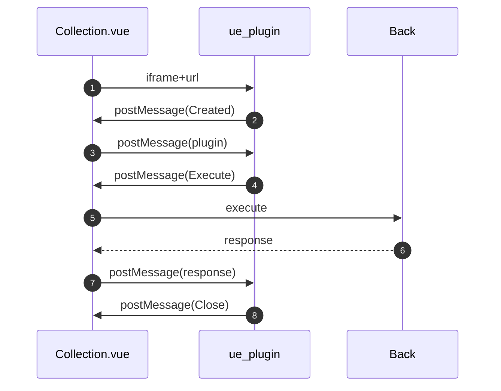

运行插件的前端部件。

调用方在`iframe`中打开插件部件，双方通过`postMessage`方法交换数据。

```mermaid
sequenceDiagram
autonumber

participant C as Collection.vue
participant P as ue_plugin

C->>P: iframe+url
P->>C: postMessage(Created)
C->>P: postMessage(plugin)
P->>C: postMessage(Execute)
C->>Back: execute
Back-->>C: response
C->>P: postMessage(response)
P->>C: postMessage(Close)
```

插件的定义详见`plugins`中的说明。
